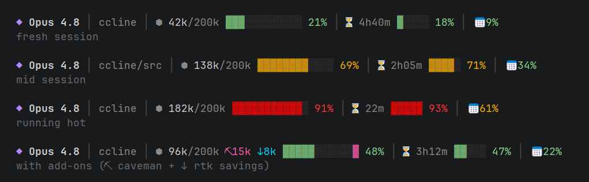

# ccline

A richer status line for [Claude Code](https://claude.ai/code) — model, project path, rate-limit burn-down, and a live context-window budget bar, in one line.



Segments run nearest-term to farthest: this conversation → 5-hour window → 7-day window.

Pure Node.js, no dependencies, single file. The four core segments render out of the box; two optional add-ons (caveman / rtk token savings) light up only if you have those tools.

## What each segment means

| Segment | Example | Meaning |
|---|---|---|
| ◆ model | `◆ Opus 4.8` | Active model display name |
| path | `dewiz/sub/dir` | Current dir, relative to project root (truncated past `pathMaxLen`) |
| ⬢ context | `⬢ 84k/200k ▓▓▓▓▓░░░ 42%` | This conversation's context tokens vs the window limit, with % |
| ⏳ 5-hour | `⏳ 3h20m ▓▓░░░ 42%` | Time until the 5-hour rate window resets, burn bar, and % used |
| 📅 7-day | `📅 18%` | 7-day rate window used |
| ⛏ caveman *(opt)* | `⛏12k` | Tokens saved this session by the [caveman](https://github.com/juliusbrussee/caveman) plugin (pink) |
| ↓ rtk *(opt)* | `↓8k` | Tokens saved this session by the `rtk` CLI (cyan) |

Bars go green → yellow → red as usage climbs (60% / 85% thresholds). All token figures are for **this conversation / this session** — no lifetime totals.

The ⛏ and ↓ segments extend the context bar *beyond* the real limit, visualizing how much longer the bar would be without those savings.

## Install

Requires [Node.js](https://nodejs.org) on your `PATH`. Clone, then run the installer for your OS — it copies the script into your Claude config dir and wires up `settings.json` (existing keys preserved):

```bash
git clone https://github.com/Alyssum-Information/ccline.git
cd ccline

# macOS / Linux
bash install.sh

# Windows (PowerShell)
powershell -ExecutionPolicy Bypass -File install.ps1
```

Restart Claude Code to see the new status line.

### Manual install

Copy `statusline.js` anywhere, then add to `~/.claude/settings.json`:

```json
{
  "statusLine": {
    "type": "command",
    "command": "node /path/to/statusline.js"
  }
}
```

On Windows, use the full paths to `node.exe` and the script:

```json
{
  "statusLine": {
    "type": "command",
    "command": "\"C:\\Program Files\\nodejs\\node.exe\" \"C:\\Users\\you\\.claude\\ccline.js\""
  }
}
```

## Configure

Everything works with zero config. To customize, drop a JSON file at `~/.claude/ccline.config.json` (or point `$CCLINE_CONFIG` at any path). Every key is optional — you only specify what you want to change. See [`examples/ccline.config.json`](examples/ccline.config.json).

| Key | Default | Purpose |
|---|---|---|
| `contextBarWidth` | `12` | Width of the ⬢ context bar |
| `rateBarWidth` | `5` | Width of the ⏳ 5-hour bar |
| `pathMaxLen` | `48` | Truncate the project path past this many chars |
| `colors` | *(see below)* | 256-color xterm indices per element |
| `segments.caveman` | `"auto"` | `auto` / `on` / `off` for the ⛏ segment |
| `segments.rtk` | `"auto"` | `auto` / `on` / `off` for the ↓ segment |

`auto` shows a segment only if its tool is detected (and skips cleanly, at zero cost, if not). `off` never runs the tool.

### Optional add-ons

- **⛏ caveman** — if you use the [caveman](https://github.com/juliusbrussee/caveman) plugin, ccline reads its `.caveman-active` flag and estimates tokens saved from your transcript. Tune `caveman.flagFile` and `caveman.ratios` in config.
- **↓ rtk** — if you use the `rtk` CLI, ccline calls `rtk gain --format json` and shows this session's delta. Tune `rtk.command` / `rtk.args` / `rtk.totalPath` in config.

If you don't have these tools, leave the defaults — the segments simply never appear.

## How it works

Claude Code pipes a JSON blob to the status-line command on stdin (model, workspace, `context_window`, `rate_limits`, `transcript_path`, …). `statusline.js` reads it, formats the segments with ANSI 256-color codes, and writes one line to stdout. Small per-session cache files in the temp dir keep it fast (transcript parse is memoized by file size; `rtk gain` is snapshotted per session).

## License

MIT © 2026 Alyssum
